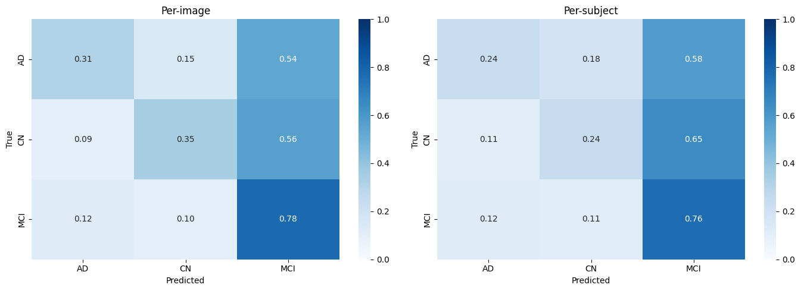
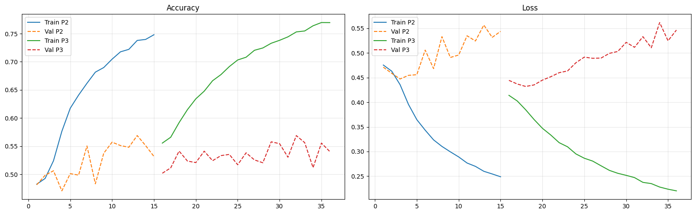
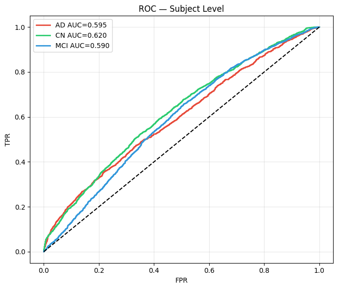

# Historical results and provenance

No new training or inference was performed for this documentation update.
Cell numbers below are zero-based JSON indices, not execution counts.

## EfficientNetB5

Source: [existing final notebook](../cnn_train_final_v7.ipynb), saved outputs in
cells 12, 13, and 15. Cell 14 contains the three plotted figures extracted here.
The notebook itself is unchanged.

| Metric | Saved value |
| --- | --- |
| Filename-group accuracy | 49.33% |
| Filename-group balanced accuracy | 41.54% |
| Macro one-vs-rest AUC | 0.6019 |
| AD one-vs-rest AUC | 0.5955 |
| CN one-vs-rest AUC | 0.6200 |
| MCI one-vs-rest AUC | 0.5904 |
| AD/CN subset AUC using the three-class CN probability | 0.6156 |

| Label | Precision | Recall | F1 | Reported groups |
| --- | --- | --- | --- | --- |
| AD | 0.38 | 0.24 | 0.29 | 1,572 |
| CN | 0.42 | 0.24 | 0.31 | 1,996 |
| MCI | 0.54 | 0.76 | 0.63 | 3,322 |

**These are not verified patient metrics.** Cell 12 only recognizes an `ADNI_`
prefix; month-6 names fall back to full filenames, including slice suffixes.
The 6,890 groups can therefore mix participants and individual slices. The
notebook reads `processed` and does not establish participant-independent splits.

The AD/CN subset AUC is not from a separately trained binary B5 model. Its
associated 24.19% accuracy still uses the three-class argmax (which can select
MCI), so it is not a conventional forced binary classification accuracy.

## PyTorch ResNet50: AD/CN

Source: original local `ADNI_project.ipynb`, cell 79, now archived as
[the baseline notebook](../notebooks/01_baseline_resnet50.ipynb). Saved outputs
were inspected before they were cleared from the added notebook. The aggregate
report is transcribed here; the original workspace notebook retains its outputs.

| Label | Precision | Recall | F1 | Test slices |
| --- | --- | --- | --- | --- |
| AD | 0.63 | 0.56 | 0.60 | 1,920 |
| CN | 0.70 | 0.76 | 0.73 | 2,580 |

Confusion matrix (rows=true, columns=predicted, order AD/CN):

```text
             Pred AD   Pred CN
True AD         1082       838
True CN          630      1950
```

Accuracy is `(1082 + 1950) / 4500 = 67.38%`; the original report prints 0.67.
This is **slice-level** evaluation after a scan-key split rebuild, not verified
participant-level evaluation. At epoch 10, saved train accuracy is 100.0% and
validation accuracy is 65.2%, indicating a substantial generalization gap on
that split.

## Earlier results and leakage audit

The original B3 output (cell 8) reports 55.00% image accuracy and 47.65% for its
filename-group aggregation, also counting 6,890 groups. The same parser problem
applies. These are historical observations, not evidence of reliable patient
classification or a controlled B3/B5 comparison.

The baseline audit (cell 77) reports 38 train/test, 40 train/validation, and 8
validation/test overlapping scan keys. Cell 78 reports zero scan-key overlaps
after rebuilding, with scan-key counts:

| Class | Train | Validation | Test |
| --- | --- | --- | --- |
| AD | 144 | 31 | 32 |
| CN | 193 | 41 | 43 |
| MCI | 316 | 67 | 69 |

Different visits may use different scan keys for the same participant. These
counts are not verified unique participant counts. The saved outputs do not
prove that B3/B5 used the rebuilt dataset.

## Saved B5 figures

The following PNGs are extracted byte-for-byte from cell 14 image outputs, not
regenerated. Their original titles say "Per-subject" or "Subject Level"; read
those labels with the grouping limitations above.







See [the improvement plan](../docs/IMPROVEMENTS.md) before interpreting these
plots as evidence of clinical usefulness or comparing them with other studies.
